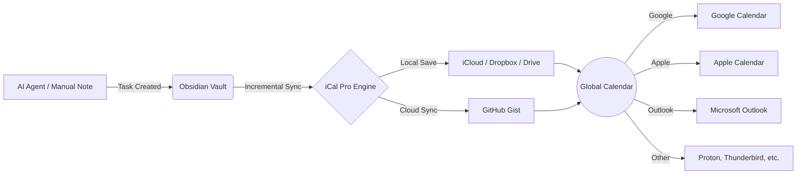

# iCal Pro for Obsidian

**Bridge the gap between AI-driven task management and your global calendar.**

iCal Pro is a professional-grade synchronization engine that turns your Obsidian tasks into live, synced calendar events. It is designed for scale, precision, and cross-platform flexibility.

---

## 🔄 The Pro Workflow

---

## 🌟 Core Functions
- **Automated Scheduling**: Parses tasks with standard dates or emojis (`📅`, `🛫`, `⏳`).
- **Rich Context Capture**: Intelligently extracts notes, lists, or blockquotes *under* your tasks.
- **Instant Performance**: O(1) Incremental Indexing means zero lag on massive vaults.
- **Universal Linking**: Direct `obsidian://` links embedded in events for one-click navigation.
- **Systematic Timezones**: Uses "Floating Time" and `X-WR-TIMEZONE` for global accuracy.

## 🛠️ Advanced Features
- **Flexible Destinations**: Choose between GitHub Gist sync or local file saving (perfect for private sync services).
- **Deep Filtering**: Include or exclude tasks using multiple tags.
- **Smart Alarms**: Recognize `⏰` symbols to set native calendar alerts.
- **Link Customization**: Choose where your Obsidian links appear (Description, Location, or Both).

## ✅ Compatible Calendars
iCal Pro generates RFC 5545 compliant `.ics` files, compatible with:
- **Google Calendar** (via Gist URL subscription)
- **Apple Calendar** (iOS, iPadOS, macOS)
- **Microsoft Outlook** (Desktop & Web)
- **Proton Calendar**
- **Thunderbird**
- **Any application supporting iCalendar subscriptions.**

---

## ⚙️ Getting Started

1. **Install**: Use [BRAT](https://github.com/TfTHacker/obsidian42-brat) and add `liuh886/obsidian-ical-plugin-pro`.
2. **Configure**: Enter your sync details in the "iCal Pro" settings tab.
3. **Verify**: Use the **"Sync Now"** button in settings to trigger your first export.
4. **Subscribe**: Copy the URL or file path and add it to your preferred calendar app.

## 📄 License
MIT | Re-architected for Pro Workflows by [liuh886](https://github.com/liuh886).
